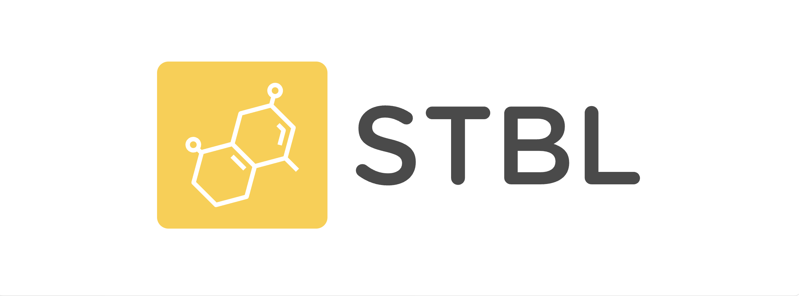

# STBL Foundation | 稳定币基金会

Hello 社区的朋友，欢迎关注 **STBL Foundation（稳定币基金会）**！  
这是由我发起的 Web3 项目，包含两个核心模块：  
- 一条高性能、高度去中心化的 EVM 兼容 Layer1 区块链  
- 人民币稳定币（即将上线）

我们的愿景是：**借助区块链的革命力量，打造下一个微信支付！**

---

## 特别致谢

本项目在构建 Layer1 区块链过程中，大量引用了 [0xPolygon edge](https://github.com/0xPolygon/edge) 组织的开源代码。  
**0xPolygon edge** 是 EVM POS 侧链的绝佳方案，为以太坊生态做出了卓越的贡献。  
在此，STBL Foundation 向 0xPolygon edge 团队表示衷心的感谢！

---

## 参与方式：捐赠你的 VPS，成为验证者节点，赚取 $STBL 代币

你可以将多余的服务器（VPS）借给我们，用于拓展 Layer1 网络。根据你的服务器上验证者的在线时长，奖励公链原生代币（可用于支付 gas 费）。  
**总计划募集 1000 台服务器**，共同打造一个高度去中心化的 Layer1 区块链，作为即将发行的人民币稳定币的流动层。

- 填写 Google 表单借出你的服务器：[点此参与](https://docs.google.com/forms/d/1yvQ-SRGMuKwI9CKaXtepRbtQYsHS8MqxEf9D8RbcWZI/edit)
- 提供 VPS 的 IP、密码和你的以太坊钱包地址
- STBL 基金会会定期根据节点在线时长发放 $STBL 代币奖励

---

## 项目计划

1. **募集节点**  
   最多募集 1000 台服务器，监控所有验证者的工作状态，定期发放公链代币作为奖励。

2. **独立 Layer1 区块链**  
   打造一条 EVM 兼容、高 TPS、高度去中心化的独立 Layer1 公链，作为人民币稳定币的载体。代码已开发完成，服务器到位即可部署。

3. **原生代币发行**  
   公链原生代币 $STBL，总量 100 亿，由 STBL 基金会持有。目前暂无 VC 投资。  
   我会在 Cetus 交易所(Sui链)发行同名 $STBL 代币，支持 1:1 兑换为STBL公链原生代币。初期价格极低，适合有信仰的朋友参与。基金会不会卖出任何代币，兑换后的代币将公开打入黑洞地址，拉升币价。

4. **寻找 VC 投资 & 稳定币发行**  
   未来将用 $STBL 公链代币抵押，向VC机构借出法币用作抵押，发行人民币稳定币。每一枚稳定币都由真实人民币资产支撑，接受机构审计，确保安全合规。

5. **大规模推广**  
   推广“公链 + 稳定币”支付模式，抢占微信支付市场。用户可质押人民币稳定币，获得公链代币奖励，实现比微信支付更高的利息收益。

---

## 社交媒体

- [Telegram 群](https://t.me/STBL_F)
- X（即将上线）
- BiliBili（即将上线）

---

## 免责声明

本项目仍在持续开发中，建议使用最新版 Edge 客户端。旧版本（0.6 及以下）将不再维护，用户可自行 fork 并根据开源协议使用。

---

Copyright 2022 Polygon Technology

Licensed under the Apache License, Version 2.0 (the "License");
you may not use this file except in compliance with the License.
You may obtain a copy of the License at

       http://www.apache.org/licenses/LICENSE-2.0

Unless required by applicable law or agreed to in writing, software
distributed under the License is distributed on an "AS IS" BASIS,
WITHOUT WARRANTIES OR CONDITIONS OF ANY KIND, either express or implied.
See the License for the specific language governing permissions and
limitations under the License.